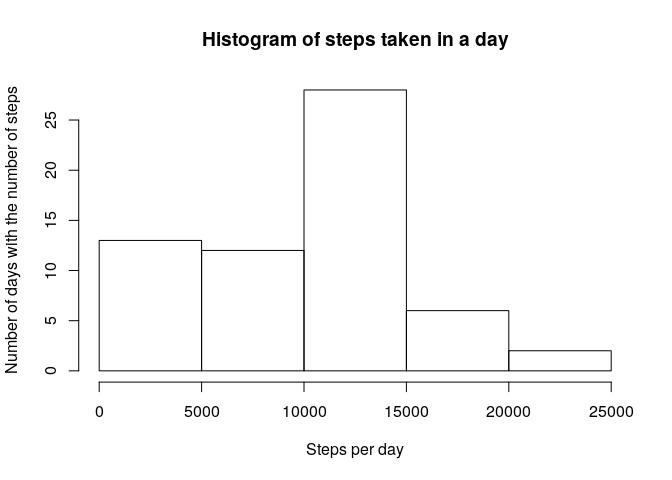
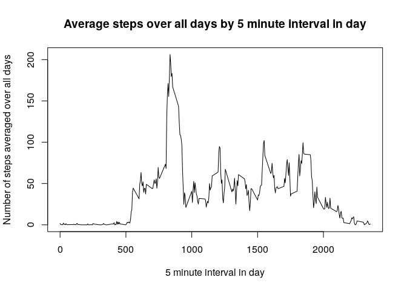
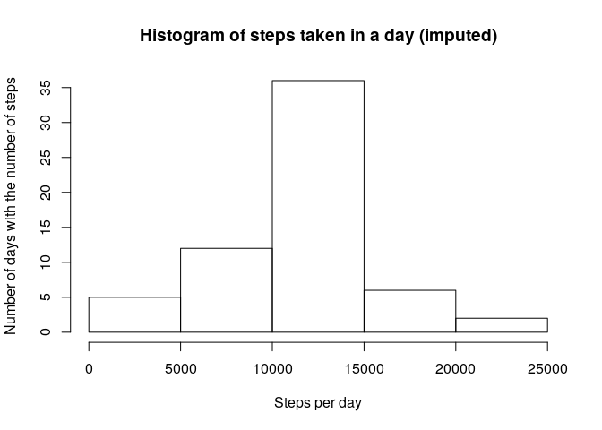
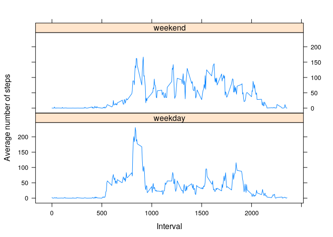

## Loading and preprocessing the data

First let's load the data.


```r
library(knitr)
opts_chunk$set(fig.path = "./figures/")
library(readr)
library(dplyr, quietly=TRUE, warn.conflicts=FALSE)
data <- read_csv('activity.zip')
```

```
## Parsed with column specification:
## cols(
##   steps = col_double(),
##   date = col_date(format = ""),
##   interval = col_double()
## )
```


## What is mean total number of steps taken per day?

Let's get the total steps per day.


```r
total_steps_by_day <- data %>% 
  group_by(date) %>% 
  summarise(total_steps=sum(steps, na.rm=TRUE), .groups="keep")
```

Now let's examine a histogram of the number of steps per day.


```r
hist(total_steps_by_day$total_steps, 
     xlab="Steps per day", 
     ylab="Number of days with the number of steps",
     main="Histogram of steps taken in a day")
```

<!-- -->

Let's get the mean steps per day.


```r
mean(total_steps_by_day$total_steps)
```

```
## [1] 9354.23
```

Now let's get the median steps per day.


```r
median(total_steps_by_day$total_steps)
```

```
## [1] 10395
```

## What is the average daily activity pattern?

Let's look at a time series plot of the 5 minute interval during a day, and the average number of steps taken during that interval across the entire day time period of the measurements.

First let's get the average steps by interval.


```r
avg_steps_by_interval <- data %>% 
  group_by(interval) %>% 
  summarize(avg_across_all_days = mean(steps, na.rm=TRUE), .groups='keep')
head(avg_steps_by_interval)
```

```
## # A tibble: 6 x 2
## # Groups:   interval [6]
##   interval avg_across_all_days
##      <dbl>               <dbl>
## 1        0              1.72  
## 2        5              0.340 
## 3       10              0.132 
## 4       15              0.151 
## 5       20              0.0755
## 6       25              2.09
```

Now let's plot it.


```r
plot(avg_steps_by_interval$interval, avg_steps_by_interval$avg_across_all_days, 
     type='l', 
     main="Average steps over all days by 5 minute interval in day", 
     xlab="5 minute interval in day", ylab="Number of steps averaged over all days")
```

<!-- -->

The time interval with the largest average number of steps is


```r
avg_steps_by_interval$interval[which.max(avg_steps_by_interval$avg_across_all_days)]
```

```
## [1] 835
```

## Imputing missing values

The total number of missing values (*NA*) in the data set.


```r
sum(is.na(data$steps))
```

```
## [1] 2304
```

The strategy for imputed values will be the mean for that time interval averaged
over all days in the data set. The values below should be the same as the values calculated above in *avg_steps_by_interval*.


```r
imputed_data <-read_csv('activity.zip')
```

```
## Parsed with column specification:
## cols(
##   steps = col_double(),
##   date = col_date(format = ""),
##   interval = col_double()
## )
```

```r
imputed_data <-imputed_data %>% 
  group_by(interval) %>% 
  mutate(steps_imputed = replace(steps, is.na(steps), mean(steps, na.rm=TRUE)))
head(imputed_data)
```

```
## # A tibble: 6 x 4
## # Groups:   interval [6]
##   steps date       interval steps_imputed
##   <dbl> <date>        <dbl>         <dbl>
## 1    NA 2012-10-01        0        1.72  
## 2    NA 2012-10-01        5        0.340 
## 3    NA 2012-10-01       10        0.132 
## 4    NA 2012-10-01       15        0.151 
## 5    NA 2012-10-01       20        0.0755
## 6    NA 2012-10-01       25        2.09
```


Now let's examine a histogram of the number of steps per day for the imputed data.


```r
imputed_total_steps_by_day <- imputed_data %>% 
  group_by(date) %>% 
  summarise(total_steps=sum(steps_imputed), .groups="keep")
hist(imputed_total_steps_by_day$total_steps, 
     xlab="Steps per day", 
     ylab="Number of days with the number of steps",
     main="Histogram of steps taken in a day (imputed)")
```

<!-- -->

Let's get the mean steps per day for the imputed data.


```r
mean(imputed_total_steps_by_day$total_steps)
```

```
## [1] 10766.19
```

Let's get the median steps per day for the imputed data.


```r
median(imputed_total_steps_by_day$total_steps)
```

```
## [1] 10766.19
```

Note that the histogram has shifted to the right and moved mass and height to the middle. The left has fewer counts. Correspondingly, the median and mean moved to the right.


## Are there differences in activity patterns between weekdays and weekends?

First the imputed data will get a factor column saying whether the date is a weekday or a weekend.


```r
by_day_type <- imputed_data %>% 
  mutate(day_type = as.factor(ifelse(weekdays(date) %in% c("Saturday", "Sunday"), "weekend", "weekday")))
```

Then the data will be grouped by interval and whether the data is a weekday or a weekend, and the average number of steps will be calculated for each grouping.


```r
avg_steps_by_interval_and_day_type <- by_day_type %>%
  group_by(interval, day_type) %>% 
  summarise(avg_steps = mean(steps_imputed), .groups="drop")
```

The following plots show the comparison between activity patterns during the weekend and during weekdays.


```r
library(lattice)
xyplot(avg_steps~interval|day_type, 
       data=avg_steps_by_interval_and_day_type, 
       layout=c(1,2),
       ylab="Average number of steps",
       xlab="Interval",
       type="l")
```

<!-- -->

Note that after time interval 1000, there are larger amounts of steps taken on thw weekends. The weekdays have more steps up to the initial high step counts in the distributions. Also the highest peak is higher on the week days.

